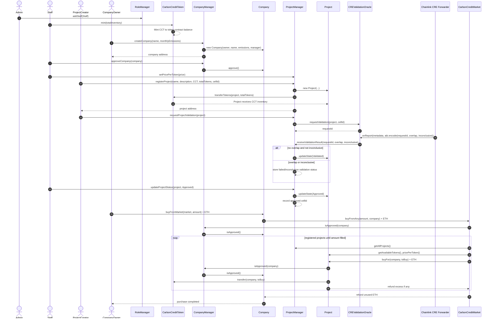
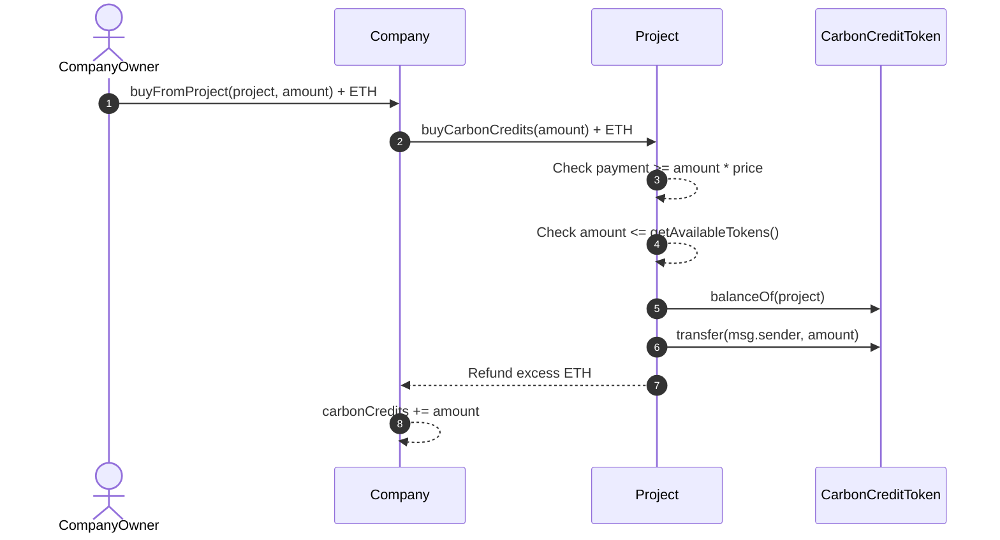
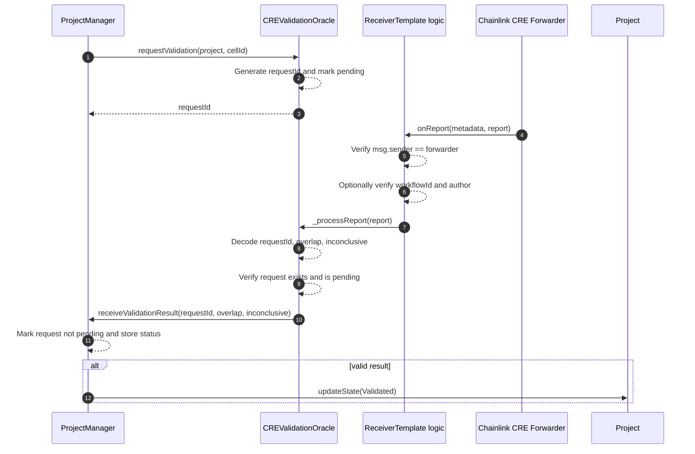
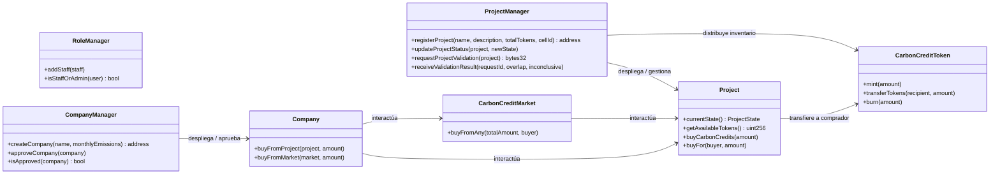
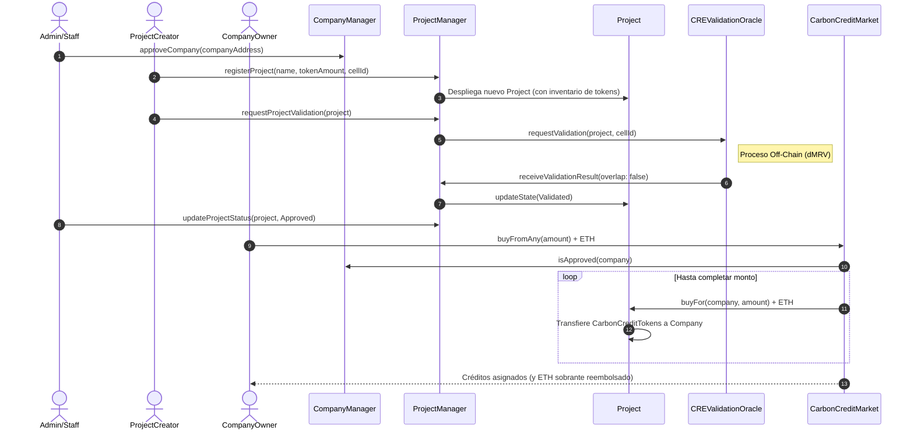
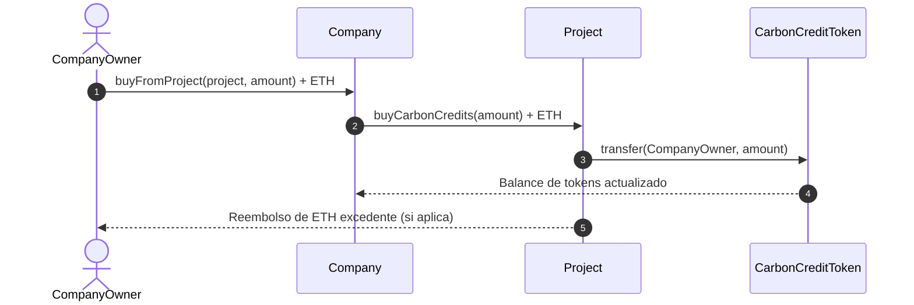
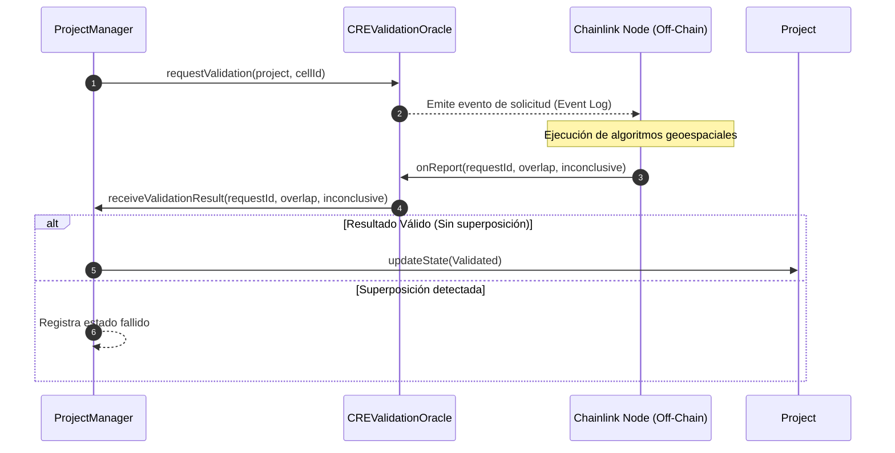

```mermaid
classDiagram
    direction LR

    class RoleManager {
        +address admin
        +address upgradeController
        +mapping staff
        +initialize(admin, upgradeController)
        +addStaff(staff)
        +removeStaff(staff)
        +isStaff(user) bool
        +isStaffOrAdmin(user) bool
        +setUpgradeController(controller)
    }

    class CarbonCreditToken {
        +address admin
        +address projectManager
        +IRoleManager roleManager
        +address upgradeController
        +initialize(projectManager, roleManager, admin, upgradeController)
        +mint(amount)
        +transferTokens(recipient, amount)
        +burn(amount)
        +pause()
        +unpause()
    }

    class CompanyManager {
        +IRoleManager roleManager
        +address upgradeController
        +mapping registeredCompanies
        +address[] companyList
        +initialize(roleManager, upgradeController)
        +createCompany(name, monthlyEmissions) address
        +approveCompany(company)
        +isApproved(company) bool
        +getAllCompanies() address[]
    }

    class Company {
        -CompanyInfo info
        -address companyManagerAddress
        +owner() address
        +name() string
        +monthlyEmissions() uint256
        +carbonCredits() uint256
        +approved() bool
        +buyFromProject(project, amount)
        +buyFromMarket(market, amount)
        +approve()
        +isApproved() bool
    }

    class ProjectManager {
        +address admin
        +address upgradeController
        +IRoleManager roleManager
        +ICompanyManager companyManager
        +address validationOracleAdapter
        +mapping registeredProjects
        +mapping usedCellIds
        +mapping approvedCellIds
        +address[] projectList
        +initialize(roleManager, companyManager, admin, upgradeController)
        +registerProject(name, description, token, totalTokens, cellId) address
        +updateProjectStatus(project, newState)
        +requestProjectValidation(project) bytes32
        +receiveValidationResult(requestId, overlap, inconclusive)
        +mockValidationResult(project, overlap, inconclusive)
        +setPricePerToken(price)
        +setValidationOracleAdapter(adapter)
        +getAllProjects() address[]
    }

    class Project {
        -ProjectMeta meta
        -ProjectAccounts accounts
        -ProjectEconomics economics
        -ProjectState state
        +projectName() string
        +projectDescription() string
        +cellId() string
        +pricePerToken() uint256
        +currentState() ProjectState
        +getReleasedTokens() uint256
        +getAvailableTokens() uint256
        +buyCarbonCredits(amount)
        +buyFor(buyer, amount)
        +updateState(newState)
        +withdrawETH(amount)
    }

    class CarbonCreditMarket {
        +IProjectManager projectManager
        +ICompanyManager companyManager
        +address upgradeController
        +initialize(projectManager, companyManager, upgradeController)
        +buyFromAny(totalAmount, buyer)
        +setUpgradeController(controller)
    }

    class ReceiverTemplate {
        -address forwarderAddress
        -bytes32 expectedWorkflowId
        -address expectedAuthor
        +onReport(metadata, report)
        +setForwarderAddress(forwarder)
        +setExpectedWorkflowId(workflowId)
        +setExpectedAuthor(author)
        +getForwarderAddress() address
        #_processReport(report)*
    }

    class CREValidationOracle {
        +address admin
        +address receiver
        +uint256 requestNonce
        +mapping validationRequestExists
        +mapping validationRequestPending
        +mapping requestProject
        +mapping requestCellId
        +setReceiver(receiver)
        +isConfigured() bool
        +requestValidation(projectAddress, cellId) bytes32
        #_processReport(report)
    }

    class ChainlinkForwarder {
        <<external>>
        +onReport(metadata, report)
    }

    RoleManager <.. CarbonCreditToken : role checks
    RoleManager <.. CompanyManager : staff/admin approval
    RoleManager <.. ProjectManager : staff/admin lifecycle

    CompanyManager --> Company : deploys / approves
    CompanyManager <.. Company : only manager can approve
    CompanyManager <.. Project : verifies approved buyer
    CompanyManager <.. CarbonCreditMarket : verifies approved buyer

    ProjectManager --> Project : deploys / updates state
    ProjectManager --> CarbonCreditToken : transferTokens to project
    ProjectManager --> CREValidationOracle : requestValidation
    ProjectManager <.. CREValidationOracle : receiveValidationResult
    ProjectManager <.. CarbonCreditMarket : getAllProjects

    Project --> CarbonCreditToken : transfer CCT to buyer
    Project --> CompanyManager : isApproved in buyFor

    Company --> Project : buyCarbonCredits
    Company --> CarbonCreditMarket : buyFromAny

    CarbonCreditMarket --> Project : buyFor buyer

    CREValidationOracle --|> ReceiverTemplate : extends
    ChainlinkForwarder --> ReceiverTemplate : calls onReport
```

# Smart Contract UML and Interaction Diagrams

## Contract relationship UML

## Main lifecycle sequence

## Direct project purchase sequence

## Validation callback sequence

# Simpler versions

## Contract relationship UML

## Main lifecycle sequence

## Direct project purchase sequence

## Validation callback sequence

